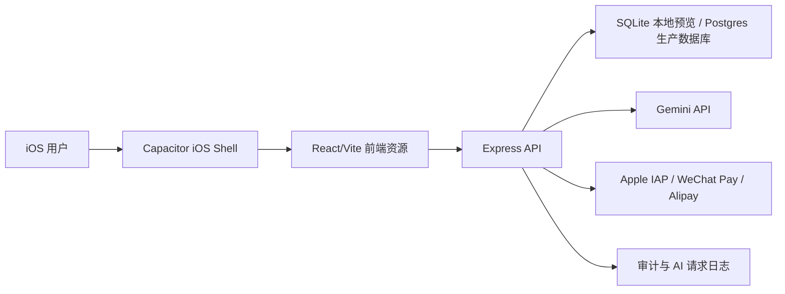

# 人生K线 iOS AI 应用完整商用设计

## 1. 目标

将现有高保真 React 产品完整承载为可上线 iOS AI 应用。设计原则是：

- 前端视觉与交互 1:1 保持，不重写 UI，不改变已有动画、布局、弹窗、导航和模块组织。
- 后端承担所有可信业务状态：登录、会话、会员、支付、用户资料、AI Key、AI 用量、审计、风控和数据备份。
- iOS 端用 Capacitor WebView 承载同一份 Vite 构建产物，最大化还原度。
- 首版以单体服务快速上线，生产数据使用 Postgres；后续在业务增长后增加 Redis、对象存储、队列和运营后台。

## 2. 产品范围

### 已承载模块

- 人生 K 线首页与命运曲线。
- 八字/命理分析报告。
- 人生使用说明书。
- 顺风窗/今日行动建议。
- 人脸估值/面相分析。
- 翻身银行/收入预测。
- 用户中心、会员弹窗、登录弹窗、设置、分享解锁。
- Gemini AI 代理与流式对话能力。

### 商用必需能力

- 第三方登录：Apple、微信、Google、手机号验证码入口。
- 用户资料：姓名、性别、出生日期、出生时间、出生地。
- 会员体系：终身/订阅计划、订单、权益、恢复购买。
- AI 成本控制：匿名预览、免费用户、会员额度。
- 隐私：资料删除、会话撤销、审计、日志留存策略。
- 运营：数据库统计、备份、压缩、日志清理、健康检查。

## 3. 高层架构



### 架构边界

- 前端只负责展示、交互和本地体验缓存。
- 服务端是唯一可信源，负责权限、会员、支付结果、AI Key、额度、审计。
- iOS 壳只负责系统能力桥接、签名、权限和 App Store 分发。

## 4. 核心用户旅程

### 首次使用

1. 用户打开 iOS App。
2. 前端读取本地缓存；本地预览调用 `/api/session`，生产 JWT 会话调用 `/api/user/me`。
3. 未登录用户进入游客体验，可浏览首页和引导。
4. 用户输入命盘资料后，本地先展示基础模拟结果。
5. 若用户登录，资料同步到 `/api/profile`；生产 JWT 用户同步到 `/api/user/profile`。
6. 兼容前端 AI 调用 `/api/gemini/*`；生产安全 AI 调用 `/api/ai/generate`，服务端检查 Key、额度、资料和会员。

### 付费开通

1. 用户点击会员入口。
2. 未登录则先触发登录。
3. 前端打开原有支付弹窗。
4. 本地预览可调用 `/api/membership/checkout` 走 mock 订单。
5. 生产 iOS StoreKit 成功后调用 `/api/payment/verify-receipt`，服务端向 Apple 验证 receipt。
6. 服务端写入 `orders` 和 `memberships`。
7. 前端通过 `/api/session` 或 checkout 响应恢复会员权益。

### 账号删除

1. 用户中心点击注销。
2. 前端请求 `DELETE /api/account`。
3. 服务端软删除用户、撤销会话、写审计事件。
4. 前端清除本地缓存并回到游客状态。

## 5. 服务端模块

| 模块 | 责任 | 当前文件 |
| --- | --- | --- |
| API Server | Express 入口、Gemini 代理、静态资源 | `server.ts` |
| Local Database | SQLite schema、会话、用户、会员、审计 | `server/database.ts` |
| Production Database | Postgres 连接、迁移、用户、订单、会员、AI 历史 | `server/postgres/*`, `db/migrations/*` |
| Routes | 业务 REST API、CORS、限流、错误处理 | `server/routes.ts` |
| Security | 安全响应头、CSP、权限策略 | `server/security.ts` |
| Validation | 请求体验证、基础净化 | `server/validation.ts` |
| Client API | 前端 API/base URL/token 处理 | `services/apiBase.ts` |
| Backend Client | 登录、资料、会员、设置同步 | `services/backendClient.ts` |

## 6. 数据设计概要

核心表：

- `users`：用户基础资料和软删除状态。
- `auth_identities`：Apple/微信/Google/手机号等身份映射。
- `sessions`：服务端会话，保存 token hash。
- `user_profiles`：命盘资料和命盘缓存。
- `orders`：支付订单。
- `memberships`：会员计划和权益。
- `user_settings`：设置、绑定、分享计数。
- `ai_request_logs`：AI 请求审计与额度统计。
- `ai_response_cache`：AI 结果缓存预留。
- `audit_events`：关键业务事件。

详见 [database-schema.md](./database-schema.md)。

## 7. API 设计概要

API 采用 JSON REST，统一响应：

```json
{ "ok": true }
```

错误响应：

```json
{ "ok": false, "error": { "message": "Validation failed" } }
```

详见 [api-contract.md](./api-contract.md) 与 [openapi.yaml](./openapi.yaml)。

## 8. 安全与隐私设计

- 会话 token 服务端只存 hash。
- Web 使用 HttpOnly Cookie，iOS 可使用 Bearer Token。
- AI Key 只保存在服务端环境变量。
- 请求体先校验再入库。
- CORS 生产环境使用 `CLIENT_ORIGINS` 白名单。
- CSP/安全头默认开启。
- AI 日志只保存 prompt hash，不保存完整 prompt。
- 删除账号采用软删除，并撤销所有会话。

详见 [privacy-security-design.md](./privacy-security-design.md)。

## 9. 非功能要求

| 类别 | 首版目标 | 增长后目标 |
| --- | --- | --- |
| 可用性 | 单实例可用，健康检查 | 多实例 + 负载均衡 |
| 数据库 | SQLite WAL | Postgres 托管高可用 |
| AI 成本 | 日额度 + 会员闸门 | Redis 额度 + 队列 + 缓存 |
| 性能 | 首页 3 秒内可交互 | JS 分包、缓存、CDN |
| 安全 | 基础 OWASP 防护 | WAF、Sentry、集中日志 |
| 合规 | 隐私政策、用户协议 | 数据导出、地区化合规 |

## 10. 迭代优先级

### P0 上线前必须完成

- Apple Developer 签名与 Bundle ID。
- Apple IAP 商品、服务端 receipt 校验。
- 生产域名、HTTPS、`CLIENT_ORIGINS`、`VITE_API_BASE_URL`。
- 隐私政策、用户协议、免责声明。
- 真实 Gemini Key 和额度策略。

### P1 上线后两周

- Postgres 迁移。
- AI response cache 落地。
- 错误监控和性能监控。
- 会员恢复购买和订单后台。
- App Store 截图与审核材料。

### P2 增长阶段

- Redis 限流和额度。
- 异步任务队列。
- A/B 测试。
- 运营后台。
- 多语言合规文案。
