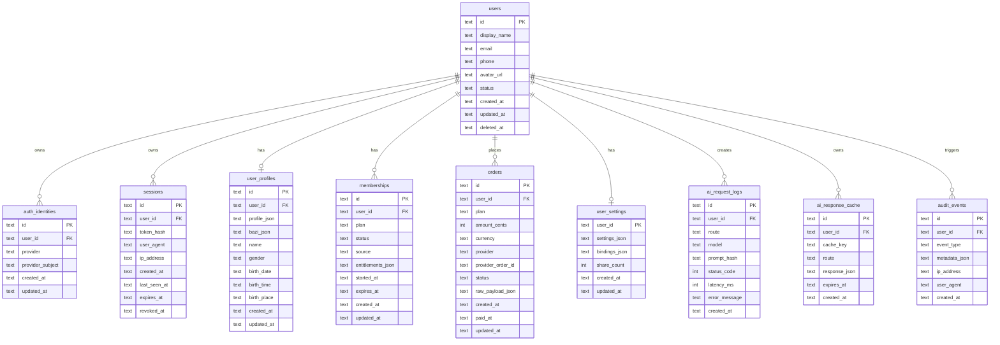

# 数据库设计与 ERD

## 当前数据库

首版使用 Node 22 内建 `node:sqlite`，数据库文件默认位于 `data/life-kline.sqlite`。表结构采用标准关系模型，方便迁移到 Postgres。

## ERD



## 表设计说明

### `users`

用户主体表。使用软删除，`deleted_at` 不为空时视为已注销。

生产建议：

- Postgres 中 `id` 使用 `uuid`。
- 对 `email`、`phone` 建唯一索引，但允许空值。
- 可增加 `role`、`risk_level`、`last_login_at`。

### `auth_identities`

第三方身份映射表。`provider + provider_subject` 唯一。

Provider 建议枚举：

- `apple`
- `wechat`
- `google`
- `phone`
- `email`
- `guest`

### `sessions`

会话表。只保存 `token_hash`，不保存明文 token。

关键索引：

- `idx_sessions_token_hash`

生产建议：

- 定期删除过期/撤销会话。
- 高并发时迁移到 Redis 或 Postgres，并对 token hash 建唯一索引。

### `user_profiles`

命盘资料表，`profile_json` 保留完整前端结构，冗余字段便于查询和运营统计。

隐私要求：

- 出生日期、出生时间、出生地属于敏感个人资料。
- 日志中不得打印完整 profile。
- 用户注销后应不可被普通业务恢复。

### `orders`

订单表，记录所有支付尝试。

Status 建议：

- `pending`
- `paid`
- `failed`
- `refunded`
- `cancelled`

生产建议：

- 增加 `idempotency_key` 防止回调重复写入。
- 对 `provider_order_id` 建唯一索引。

### `memberships`

会员权益表。当前以 active membership 判断是否会员。

Entitlements 当前设计：

```json
{
  "baziReport": true,
  "lifeBook": true,
  "smoothSailing": true,
  "aiAdvisor": true,
  "valuation": true,
  "revenueForecast": true
}
```

### `ai_request_logs`

用于 AI 成本、额度和错误分析。只存 prompt hash，不存完整 prompt。

关键索引：

- `idx_ai_request_logs_user_created`

### `ai_response_cache`

AI 结果缓存预留表。适合缓存命盘报告、顺风窗、人生说明书等高成本稳定结果。

建议 cache key：

```text
<feature>:<userId>:<profileHash>:<date-or-version>
```

### `audit_events`

记录安全和业务关键事件。

建议事件：

- `auth.user_created`
- `auth.login`
- `profile.upserted`
- `billing.order_created`
- `billing.order_paid`
- `settings.updated`
- `account.deleted`

## SQLite 到 Postgres 迁移映射

| SQLite | Postgres |
| --- | --- |
| `TEXT id` | `uuid` |
| `TEXT created_at` | `timestamptz` |
| `TEXT *_json` | `jsonb` |
| `INTEGER` | `integer` / `bigint` |
| `UNIQUE(user_id, cache_key)` | 同名 unique index |

迁移顺序：

1. 创建 Postgres schema。
2. 导出 SQLite 数据。
3. JSON 字段转 `jsonb`。
4. 时间字段转 `timestamptz`。
5. 验证表行数和关键用户会话。
6. 切换 `DATABASE_URL`。

## 数据保留策略

- 用户 profile：保留至用户删除账号。
- sessions：过期后 30-90 天清理。
- orders/memberships：按财务合规周期保留。
- ai_request_logs：默认 180 天。
- audit_events：默认 180 天，生产可延长到 365 天。
