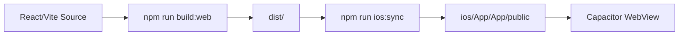

# 前端 1:1 复刻与验收设计

## 1. 原则

当前 React/Vite 前端已经是产品真实视觉实现。iOS 端不进行 React Native 重写，使用 Capacitor 承载同一份构建产物，以避免视觉、动画、布局和交互偏差。

不可改动项：

- 页面结构和模块顺序。
- 底部导航位置和状态。
- 会员弹窗文案、动效、支付步骤。
- 登录弹窗视觉、tab、按钮、Apple 模拟认证节奏。
- 人生说明书封面与卡片布局。
- 三维罗盘、K 线、顺风窗、人脸估值等模块视觉。
- 现有 CSS 色彩、字体尺寸、玻璃拟态、阴影和动效。

## 2. iOS 承载方式



## 3. 允许改动范围

允许：

- 数据来源从 localStorage 模拟切到后端 API。
- 支付成功事件携带 method/plan/amount。
- AI 调用带 session token。
- iOS 权限配置。
- 安全、缓存、错误处理。

不允许：

- 改变可见 UI。
- 重排导航、卡片或弹窗。
- 替换产品配色。
- 改动用户已经能看见的文案，除非为 App Store 合规必须增加免责声明。

## 4. 验收视口

每次视觉相关变更至少截图：

- Desktop：`1280x720`
- iPhone 13/14/15 近似：`390x844`
- iPhone SE 近似：`375x667`
- iPad portrait：`768x1024`

当前验证产物：

- `verification-home.png`
- `verification-mobile.png`

## 5. 自动检查建议

后续可加入 Playwright 视觉回归：

```bash
npx playwright screenshot --viewport-size=390,844 http://127.0.0.1:3000 screenshots/home-mobile.png
```

建议建立截图基线：

- 首页未激活状态。
- 激活表单。
- 登录弹窗。
- 支付弹窗 offer 步骤。
- 用户中心会员页。
- 人脸估值相机页。
- 顺风窗主页。
- 人生说明书页。

## 6. iOS 注意事项

- 保持 `viewport-fit=cover`。
- 确认底部导航不被 Home Indicator 遮挡。
- 摄像头模块必须有 `NSCameraUsageDescription`。
- 大体积 JS 首屏需要后续分包优化，但首版不为性能牺牲视觉还原。
- 如果接远程 API，必须用 `VITE_API_BASE_URL` 构建 iOS。

## 7. 前端风险

| 风险 | 处理 |
| --- | --- |
| WebView 与桌面浏览器渲染差异 | 真机截图验收 |
| JS chunk 过大 | 后续分包，不影响首版还原 |
| 摄像头权限失败 | Info.plist + 真机测试 |
| App Store 审核要求免责声明 | 使用独立合规弹窗或设置页链接，避免改主 UI |
| 后端失败影响体验 | 保留 localStorage/offline fallback |
