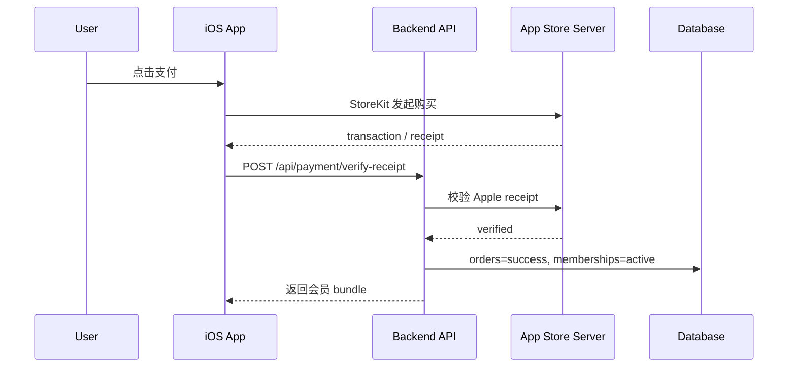
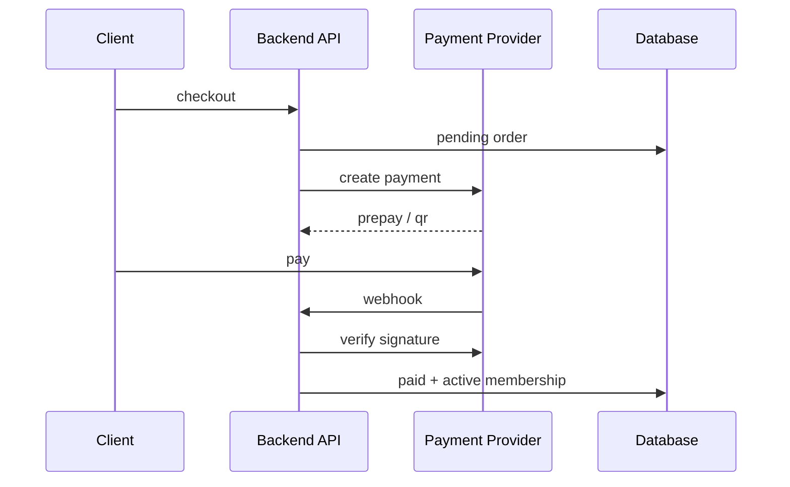

# 支付与订阅设计

## 1. 当前状态

当前实现已经有订单和会员表：

- `orders`：记录每次支付尝试。
- `memberships`：记录用户当前权益。

本地默认 `PAYMENTS_MODE=mock`，支付成功会直接写入会员，方便内测和前端联调。生产必须使用 `PAYMENTS_MODE=live` 并接真实验签。

## 2. 商品设计

| 商品 | plan | 建议 Apple Product ID | 价格 | 类型 |
| --- | --- | --- | --- | --- |
| 终身权限 | `lifetime` | `life_kline_lifetime_1880` | CNY 18.80 | Non-consumable |
| 月度权限 | `monthly` | `life_kline_monthly_880` | CNY 8.80 | Auto-renewable subscription |

当前 UI 主要展示终身权限。若保留月度权益，需要在 App Store Connect 创建订阅组，并在前端补恢复订阅入口。

## 3. Apple IAP 流程

## 4. Apple 服务端验签

当前后端已实现 StoreKit 2 signed transaction 与 receipt 双通道校验：

- `POST /api/payment/verify-receipt`
- iOS 可上传 `signedTransactionInfo`、`receiptData`、`productId`、`transactionId`。
- 服务端优先使用 Apple 官方服务端库验签 StoreKit 2 JWS。
- 缺失 JWS 时兼容 legacy `verifyReceipt`，并支持 sandbox/production 自动切换。
- 使用 `transaction_id` 幂等写入 `orders`。
- 成功后按商品写入/更新 `memberships`。
- 不直接保存完整 receipt/JWS 字符串，只保存 hash 与脱敏后的 Apple 响应。

当前后端已实现 App Store Server Notifications V2：

- `POST /api/webhooks/apple`
- 使用 Apple 官方 Node 服务端库和 Apple Root Certificates 验签 `signedPayload`。
- 按 `notificationUUID` 幂等记录到 `app_store_notifications`。
- 对 `DID_RENEW`、`EXPIRED`、`REFUND`、`REVOKE`、`DID_FAIL_TO_RENEW` 等事件更新 `orders` 和 `memberships`。
- 未匹配到本地用户的有效通知标记为 `unmatched`，便于后续对账。

生产环境必须配置：

- `PAYMENTS_MODE=live`
- `APPLE_IAP_ENV=production`
- `APPLE_SHARED_SECRET`
- `APPLE_IAP_PRODUCT_IDS`
- `APPLE_ROOT_CERTIFICATE_PATHS` 或 `APPLE_ROOT_CERTIFICATES_PEM`
- 生产通知验签需要 `APPLE_APP_APPLE_ID`

已补充字段：

- `orders.original_transaction_id`
- `orders.provider_payload_hash`
- `orders.verified_at`
- `memberships.original_transaction_id`
- `memberships.current_transaction_id`
- `app_store_notifications`
- `api_rate_limits`

## 5. 微信/支付宝流程

微信和支付宝在 iOS App 内应谨慎使用，需符合 App Store 对数字内容的规则。若会员权益属于 App 内数字服务，优先使用 Apple IAP。微信/支付宝可用于 Web 端或线下非数字服务，但不建议作为 iOS 内购主支付方式。

Web/非 iOS 流程：

## 6. Webhook 设计

已实现端点：

- `POST /api/webhooks/apple`
- `POST /api/webhooks/wechat-pay`
- `POST /api/webhooks/alipay`

Webhook 原则：

- 先验签，再读取 payload。
- 使用 provider transaction id 幂等。
- 永远记录原始 payload hash，不直接把敏感 payload 写日志。
- 回调成功后异步通知前端或让前端轮询 `/api/session`。

## 7. 退款与过期

### 退款

订单状态改为 `refunded`，会员状态改为：

- 终身商品：`revoked`
- 订阅商品：按 Apple 通知处理到期/撤销

### 订阅过期

订阅商品根据 App Store Server Notification 更新：

- `DID_RENEW`：延长 `expires_at`
- `EXPIRED`：设为 `expired`
- `REFUND`：设为 `revoked`
- `DID_CHANGE_RENEWAL_STATUS`：记录状态但不一定立即停权

## 8. 恢复购买

iOS 必须提供恢复购买能力。

设计：

1. 前端用户中心增加“恢复购买”入口。
2. iOS StoreKit 拉取当前用户 transaction。
3. 调 `/api/payment/verify-receipt` 上传 `signedTransactionInfo`，并兼容上传 receipt。
4. 服务端验证后恢复 `memberships`。

## 9. 风控

- 订单金额必须服务端校验，不能信任前端传入金额。
- 会员权益只按服务端 `memberships` 判断。
- 前端生产包必须关闭 `VITE_ALLOW_LOCAL_PREMIUM_FALLBACK`，后端未返回 active membership 时不能本地解锁。
- 同一 transaction id 只能成功入账一次。
- 回调 IP、签名、时间戳、nonce 都要验证。
- 支付失败不能开通权益。

## 10. 上线前任务

- 在 App Store Connect 创建商品。
- 接 StoreKit 前端桥接或 Capacitor IAP 插件。
- 服务端实现 Apple transaction verification。
- 将 `PAYMENTS_MODE=live`。
- 增加恢复购买按钮和流程。
- 增加退款/过期 webhook。
- 补订单后台或至少补运维查询脚本。
